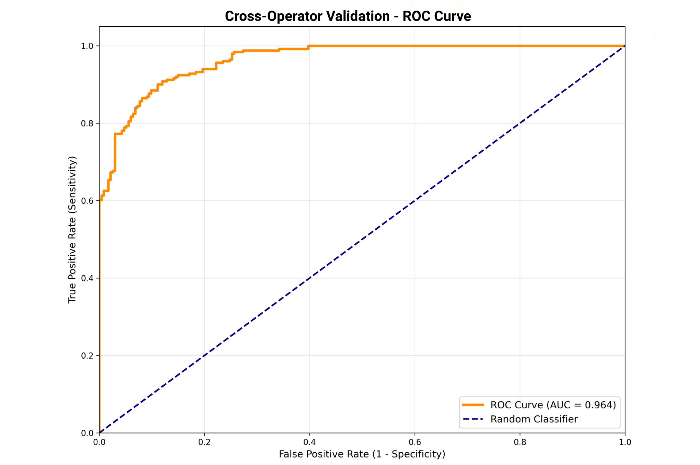
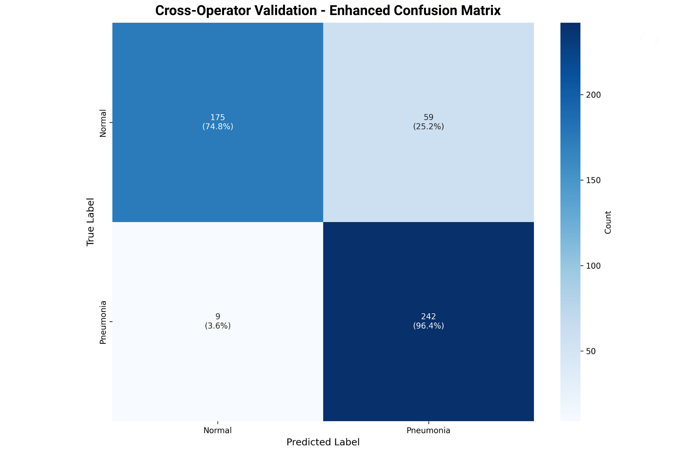

# 🥽 Pediatric Chest X-Ray Pneumonia Detection with Cross-Operator Validated AI System

[](https://python.org)
[](https://tensorflow.org)
[](https://pneumodetectai.streamlit.app)
[](https://huggingface.co/ayushirathour/chest-xray-pneumonia-detection)
[](https://github.com/ayushirathour/chest-xray-pneumonia-detection)

**Advanced Deep Learning Model with Clinical-Grade Performance & Real-World Validation**

*Developed by **Ayushi Rathour***

***

## 🎯 **Why It Matters**

Pneumonia affects millions globally, requiring rapid and accurate diagnosis from chest X-rays, especially in pediatric patients (ages 1 to 5). This AI system addresses the critical need for reliable automated screening with **rigorous cross-operator validation**, something most medical AI projects lack.

### **🏆 Key Achievements:**
* **86% Cross-Operator Validation Accuracy** on 485 independent samples
* **96.4% Sensitivity** catches 96% of pneumonia cases  
* **Strong Generalization** with only 8.8% accuracy drop on unseen data
* **Production Ready** with live web interface and RESTful API

> **⚡ TL;DR:** AI detects pneumonia in pediatric chest X-rays with clinically validated performance. **[Try Live Demo](https://pneumodetectai.streamlit.app/)** | **[Download Model](https://huggingface.co/ayushirathour/chest-xray-pneumonia-detection)**

***

## 🌐 **Live Experience**


*Upload → AI Analysis → Clinical Results in 2.5 seconds*

### **🚀 [Try PneumoDetect AI Live](https://pneumodetectai.streamlit.app/)**

**Professional Medical Interface Features:**
* **Instant Analysis** with sub-second inference and confidence scores
* **DICOM Support** for professional radiology format (.dcm files)
* **AI Attention Maps** provide visual explanation of model decisions
* **PDF Reports** generate clinical-grade reports with dual image layout
* **Zero Data Storage** ensures completely secure local processing
* **Mobile Responsive** works seamlessly across all devices

***

## 📊 **Proof of Reliability**

### **🔬 Rigorous Dual Validation**

| Validation Type | Dataset | Sample Size | Purpose |
|----------------|---------|-------------|---------|
| **Internal** | [Training Dataset](https://www.kaggle.com/datasets/paultimothymooney/chest-xray-pneumonia) | 269 samples | Model development |
| **Cross-Operator** | [Independent Dataset](https://www.kaggle.com/datasets/iamtanmayshukla/pneumonia-radiography-dataset) | 485 samples | Real-world testing |

While both datasets originate from Guangzhou Women and Children's Medical Center, our validation set represents distinct patient cohorts with no overlap with training data, independent radiology review teams, and separate quality control pipelines. This constitutes an independent cohort within the same institution, sometimes referred to as cross-operator validation.

### **📈 Performance Metrics**

| Metric | Internal | Cross-Operator | Drop | Clinical Significance |
|--------|----------|----------|------|----------------------|
| **Accuracy** | 94.8% | **86.0%** | 8.8% ↓ | ✅ Good generalization |
| **Sensitivity** | 89.6% | **96.4%** | 6.8% ↑ | ✅ Excellent screening |
| **Specificity** | 100.0% | **74.8%** | 25.2% ↓ | ⚠️ Acceptable for screening |
| **ROC-AUC** | 98.8% | **96.4%** | 2.4% ↓ | ✅ Outstanding discrimination |

### **🏥 Clinical Interpretation**
The **96.4% sensitivity** means this system catches 96 out of 100 pneumonia cases, which is excellent for initial screening. The **25.2% false positive rate** is acceptable for a screening tool, as it's better to flag healthy cases for review than miss pneumonia cases.

### **📊 Detailed Validation Results**


*ROC-AUC: 0.964 showing outstanding diagnostic discrimination*


*175 TP, 59 FP, 9 FN with percentage annotations*


*Internal vs Cross-Operator validation showing robust generalization*


*Model calibration analysis for reliable probability estimates*


*Complete performance overview in single visualization*

***

## 🎯 **Project Overview**

This end-to-end medical AI system demonstrates the complete journey from research to production deployment, with emphasis on **cross-operator validation**, a critical step often missing in academic projects. The system is focused on pediatric (ages 1 to 5) chest X-rays for targeted clinical impact.

### **🏗️ Complete ML Pipeline:**
* **Data Processing** with balanced dataset creation and preprocessing
* **Model Training** using transfer learning with MobileNetV2 backbone
* **Dual Validation** combining internal development and cross-operator generalization testing
* **Web Deployment** through professional Streamlit interface
* **API Development** with RESTful FastAPI backend
* **Model Hosting** via professional distribution through Hugging Face Hub

***

## 🚀 **Quick Start**

*Choose your preferred way to get started:*

### **🌐 Option 1: Live Web App (No Setup)**
**🔗 [Try PneumoDetect AI Now](https://pneumodetectai.streamlit.app/)**
* Upload X-rays instantly and get results in 2.5 seconds
* Perfect for testing, demos, and quick analysis

### **💻 Option 2: Run Locally (Streamlit)**
```bash
git clone https://github.com/ayushirathour/chest-xray-pneumonia-detection
cd chest-xray-pneumonia-detection/api
pip install -r requirements.txt
streamlit run streamlit_api_folder/streamlit_app.py
```

### **🔌 Option 3: API Server (FastAPI)**
```bash
# Same setup as above, then:
uvicorn main:app --host 0.0.0.0 --port 8000
# Access docs at: http://localhost:8000/docs
```

### **📥 Option 4: Use Pre-trained Model**
```python
from huggingface_hub import hf_hub_download
import tensorflow as tf

# Download and load model
model_path = hf_hub_download(
    repo_id="ayushirathour/chest-xray-pneumonia-detection", 
    filename="best_chest_xray_model.h5"
)
model = tf.keras.models.load_model(model_path)
```

### **🔬 Option 5: Train Your Own Model**

```bash
# Download datasets (links in Dataset section below)
python scripts/analyze_and_balance.py
python scripts/create_balanced_dataset.py

# Train and evaluate
python scripts/train_model.py
python scripts/evaluate_model.py
python scripts/cross-operator_validation.py
```

***

## 🚀 **API for Developers**


*Powerful API workflow: Send Request → Get JSON Response → Process Results*

### **🔗 Key Endpoints:**
* `POST /predict` uploads X-ray image for pneumonia detection
* `GET /health` checks API health and model status
* `GET /stats` retrieves cross-operator validation performance metrics
* `GET /docs` provides interactive Swagger documentation

### **📊 Sample Response:**
```json
{
  "diagnosis": "PNEUMONIA",
  "confidence": 92.54,
  "confidence_level": "High",
  "recommendation": "Strong indication of pneumonia. Recommend immediate medical attention.",
  "raw_score": 0.9253779053688049,
  "timestamp": "2025-08-18T15:18:33.827996",
  "filename": "person34_virus_76.jpeg",
  "image_size": "(1648, 1400)x1400",
  "cross_operator_validation_performance": {
    "accuracy": "86.0%",
    "sensitivity": "96.4%",
    "specificity": "74.8%",
    "validated_on": "485 independent samples"
  },
  "disclaimer": "This AI assistant is for preliminary screening only. Always consult healthcare professionals for medical decisions."
}
```

### **🐍 Python Integration:**
```python
import requests

# Simple prediction
with open("chest_xray.jpg", "rb") as f:
    response = requests.post("http://localhost:8000/predict", files={"file": f})
    result = response.json()
    print(f"Diagnosis: {result['diagnosis']} ({result['confidence']}%)")
```

***

## 🧠 **Technical Architecture**

### **🤖 Model Design Rationale:**
* **MobileNetV2 Backbone** optimized for deployment efficiency over maximum accuracy
* **Trade-off Analysis** shows 3% lower accuracy than ResNet50, but 5x faster inference
* **Resource Optimization** with 14MB model enables low-resource deployment
* **Transfer Learning** uses ImageNet pre-training for efficient medical adaptation

### **🏗️ Architecture Diagram:**
```mermaid
graph TD
    A[224x224 X-ray Image] --> B(MobileNetV2 Backbone)
    B --> C[Global Average Pooling]
    C --> D[Dropout Layer 0.5]
    D --> E[Dense Layer 128 units]
    E --> F[Sigmoid Output]
    F --> G{Pneumonia Probability}
    G --> H[Normal < 0.5]
    G --> I[Pneumonia ≥ 0.5]
```

### **🗃️ System Components:**
* **Frontend:** Streamlit with glassmorphic medical design
* **Backend:** FastAPI with async request handling  
* **Model Serving:** TensorFlow 2.19.0 with optimized inference
* **Deployment:** Multi-platform (Streamlit Cloud, Docker ready)
* **Documentation:** Auto-generated OpenAPI specs

### **📁 Project Structure:**
```
chest-xray-pneumonia-detection/
├── api/                 # Streamlit frontend, FastAPI backend, model weights, dependencies
├── scripts/             # Model training, evaluation, dataset preprocessing  
├── results/             # Validation results and performance plots
├── demo/                # Application demo GIF
├── README.md            # Project documentation
├── requirements.txt     # Python dependencies
├── LICENSE              # License info
└── .gitignore           # Git ignore rules
```

***

## 📊 **Datasets & Preprocessing**

### **📁 Data Sources**
**Important:** Datasets are NOT included in repository. Manual download required:

* **Training Data:** [Chest X-Ray Images (Pneumonia)](https://www.kaggle.com/datasets/paultimothymooney/chest-xray-pneumonia) with ~2GB dataset (pediatric patients, ages 1 to 5)
* **Cross-Operator Validation:** [Pneumonia Radiography Dataset](https://www.kaggle.com/datasets/iamtanmayshukla/pneumonia-radiography-dataset) with 485 samples (pediatric patients, ages 1 to 5)

### **Key Differences Between Datasets**

| Aspect | Training Dataset (Mooney et al., Cell 2018) | Cross-Operator Dataset (Pratibha-verified "Radiography") |
|---|---|---|
| Source & Cohort | Guangzhou Women & Children's Medical Center; retrospective X-rays of patients **1–5 yrs** collected for routine care. | Same hospital but **different acquisition teams & radiology reviewers** (hence "cross-operator"); images were re-exported and re-audited independently. |
| Size & Split | **5,863 images** already split into `train / test / val`. | **4,929 images** (1,249 Normal, 3,680 Pneumonia) also in `train / test / val`, but class counts differ. |
| Pneumonia Sub-types | Label is binary (Pneumonia vs Normal). | Pneumonia folder contains **Bacterial (2,435) vs Viral (1,245)** counts (still used as a single "Pneumonia" class in our model). |
| Quality-Control Pipeline | Two expert physicians graded all scans; a third physician double-checked the evaluation split. | All low-quality scans **manually removed**; initial dual-review + final audit by **Dr. Pratibha (senior radiologist)**. |
| Label Consistency | Labels follow original Cell 2018 study protocol. | Labels re-verified in 2024 audit; eliminates a handful of mis-labels reported in the original set. |
| Class Balance | Roughly **3.3×** more Pneumonia than Normal (4,273 vs 1,583); imbalance handled later by our balancing script. | Imbalance even higher (**≈3×**), but counts differ → provides a *new* distribution for robustness testing. |
| File Provenance | JPEGs exported directly from PACS in 2017-2018. | Same imaging hardware, but **different technologists (operators)** and separate export batch → tests operator-to-operator variation (cross-operator generalization). |
| Licensing | CC BY 4.0. | CC0 (public domain). |

**Why This Matters for the Model**  
* The **training dataset** teaches the network typical pediatric patterns under one operator workflow.  
* The **cross-operator dataset** probes generalization when image export settings, technicians, and a fresh radiology audit change, mirroring real-world variability.  
* Using both ensures the model is not just memorizing plate-specific noise or labeling quirks and gives the reported **86% accuracy / 96% sensitivity** on truly independent data.

### **🔄 Preprocessing Pipeline:**
1. Download datasets from provided Kaggle links
2. Run `python scripts/analyze_and_balance.py` for data analysis
3. Execute `python scripts/create_balanced_dataset.py` for preprocessing
4. Balanced datasets created locally (1K+ training images)

***

## ⚠️ **Medical Disclaimers**

### **🚨 Critical Limitations**
* **Research Prototype** is NOT a medical device or FDA/CE approved
* **Screening Tool Only** is NOT for definitive diagnosis
* **Professional Review Required** as all results need radiologist oversight
* **25.2% False Positive Rate** means 1 in 4 normal cases may be flagged incorrectly
* **Pediatric Focus** is optimized for ages 1 to 5; performance on other age groups untested

### **📊 Technical Constraints**
* **Binary Classification** cannot detect specific pneumonia types
* **Image Quality Dependent** as performance degrades with poor quality scans
* **Dataset Limitations** include limited population and imaging protocol diversity
* **No Clinical Context** cannot consider patient history or symptoms

### **✅ Appropriate Use Cases**
* Academic research and methodology demonstration
* Educational AI in healthcare training
* Technical portfolio projects
* **NOT for clinical diagnosis or patient care decisions**

***

## 🚀 **Get Involved & Contact**

### **🎯 Take Action:**
* **[🌐 Try Live Demo](https://pneumodetectai.streamlit.app/)** to experience the system in 2.5 seconds
* **[📥 Download Model](https://huggingface.co/ayushirathour/chest-xray-pneumonia-detection)** to integrate into your projects
* **[⭐ Star Repository](https://github.com/ayushirathour/chest-xray-pneumonia-detection)** to support open medical AI
* **[📖 API Documentation](http://localhost:8000/docs)** when running locally

### **👥 Collaboration Opportunities:**
* 🩺 **Medical Professionals** for clinical validation and expert feedback
* 🎨 **UI/UX Designers** for enhanced medical interface design
* 💻 **Python Developers** for API optimization and new features
* 📊 **Data Scientists** for model improvement and validation expansion

### **📞 Contact:**
**Ayushi Rathour** *Biotechnology Graduate | Building AI for Healthcare*
* **📧 Email:** [ayushirathour1804@gmail.com](mailto:ayushirathour1804@gmail.com)
* **💼 LinkedIn:** [Ayushi Rathour](https://linkedin.com/in/ayushi-rathour)
* **🐙 GitHub:** [@ayushirathour](https://github.com/ayushirathour)
* **🤗 HuggingFace:** [ayushirathour](https://huggingface.co/ayushirathour)

***

## 📄 **Citation & License**

```bibtex
@misc{rathour2025pneumonia,
    title={Chest X-Ray Pneumonia Detection: Cross-Operator Validated AI System},
    author={Rathour, Ayushi},
    year={2025},
    note={Cross-operator validation on 485 independent samples},
    url={https://github.com/ayushirathour/chest-xray-pneumonia-detection}
}
```

**License:** MIT (See LICENSE for complete terms)

***

## 🏆 **Acknowledgments**

* **Training Dataset:** [Paul Timothy Mooney Chest X-Ray Images](https://www.kaggle.com/datasets/paultimothymooney/chest-xray-pneumonia)
* **Cross-Operator Validation:** [Tanmay Shukla Pneumonia Radiography](https://www.kaggle.com/datasets/iamtanmayshukla/pneumonia-radiography-dataset)
* **Frameworks:** TensorFlow, scikit-learn, Streamlit, FastAPI
* **Hosting:** Hugging Face Hub, Streamlit Cloud

***

**⚡ Advancing AI in Healthcare Through Rigorous Validation & Accessible Deployment**

*Demonstrating that medical AI can be both scientifically robust and practically accessible to the global community.*
